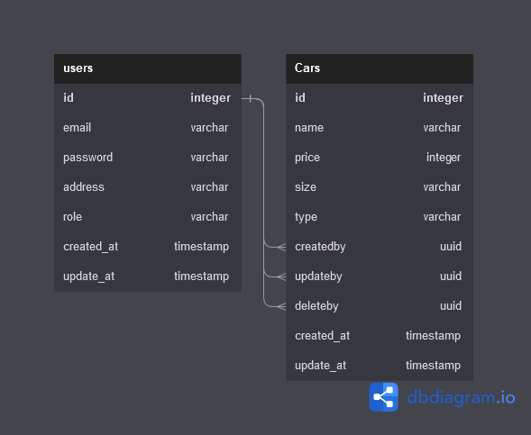

# Challenge Chapter 5 - Car Management API

This project is about implemetation of Design Pattern with Service Repository, Authentication with JWT Token and API documentation with standarized Open API which used Swagger UI.

## Database Diagram


## Super Admin Data

- email : superadmin@gmail.com
- password : SuperAdmin

## ENDPOINT API Documentation

- http://{{host}}/api/v1/api-docs

## How To Run

1. Install Library

```bash
npm install
```

2. Create Database

```bash
npm run db:create
```

3. Migrating the model

```bash
npm run db:migrate
```

4. Using seeder

```bash
npm run db:seed
```

5. Running Project on development

```bash
npm run dev
```